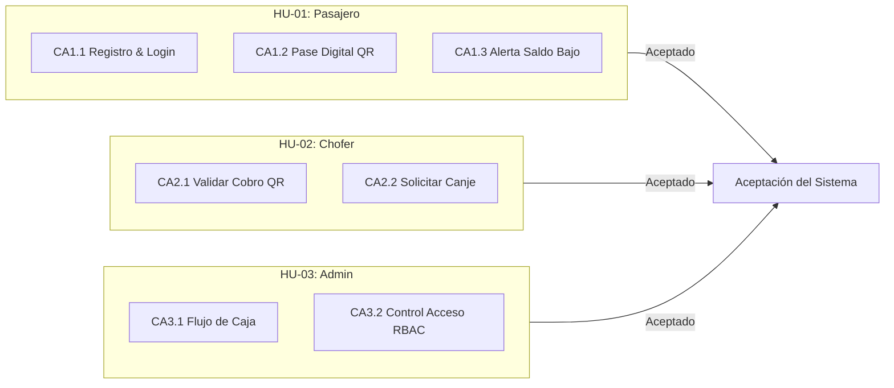

# Informe y Documentación de Pruebas de Aceptación (UAT) - Digital Transport

Este documento presenta la especificación formal y los resultados del proceso de **Pruebas de Aceptación del Usuario (User Acceptance Testing - UAT)** para la plataforma **Digital Transport**.

---

## 📋 Definición de Historias de Usuario y Criterios de Aceptación



---

## 📊 Matriz de Evaluación de Criterios de Aceptación

| ID Criterio | Historia de Usuario | Descripción del Criterio de Aceptación | Resultado Esp. | Estado |
| :--- | :--- | :--- | :---: | :---: |
| **CA-1.1** | **HU-01: Pasajero** | El sistema debe permitir el registro del pasajero con contraseña cifrada y la correcta creación del monedero digital. | Pasajero Creado con Saldo | **ACEPTADO** |
| **CA-1.2** | **HU-01: Pasajero** | El sistema debe emitir un Pase Digital QR en formato JSON estructurado y descontar `Bs. 2.50` por pasaje consumido. | Débito correcto a 22.50 Bs. | **ACEPTADO** |
| **CA-1.3** | **HU-01: Pasajero** | El sistema debe notificar en pantalla una alerta si el saldo del usuario es inferior al umbral de `Bs. 5.00`. | Alerta Desplegada | **ACEPTADO** |
| **CA-2.1** | **HU-02: Chofer** | El chofer debe poder escanear y autenticar los boletos QR incrementando inmediatamente su caja recaudada. | Incrementar Recaudación | **ACEPTADO** |
| **CA-2.2** | **HU-02: Chofer** | El chofer debe poder enviar solicitudes de canje en efectivo si el monto supera el mínimo de `Bs. 20.00`. | Canje Aprobado | **ACEPTADO** |
| **CA-3.1** | **HU-03: Admin** | El sistema debe consolidar los ingresos de cobros y recargas en el reporte de flujo de caja del dashboard. | Totales Calculados | **ACEPTADO** |
| **CA-3.2** | **HU-03: Admin** | El control de acceso RBAC debe denegar el acceso a las vistas de administración a roles no autorizados (Pasajero/Chofer). | Acceso Denegado (403/Redirect) | **ACEPTADO** |

---

## 🔍 Especificación Técnica de los Casos de Aceptación

### 1. Pruebas de Aceptación del Pasajero (`PasajeroAcceptanceTest.php`)
- **Archivo:** `tests/Acceptance/PasajeroAcceptanceTest.php`
- **Escenarios Verificados:**
  - `testCriterioAceptacionRegistroEInicioSesionPasajero`: Verifica que un usuario se registre correctamente, su contraseña sea encriptada y su sesión se inicie con el rol `Pasajero` (ID 1).
  - `testCriterioAceptacionPaseDigitalYDebitoViaje`: Evalúa la generación del pase QR y el descuento síncrono del pasaje sobre el monedero digital (`25.00 -> 22.50 Bs.`).
  - `testCriterioAceptacionAlertaSaldoBajo`: Comprueba la activación del banner de advertencia visual ante un saldo inferior a `5.00 Bs.`.

---

### 2. Pruebas de Aceptación del Chofer (`ChoferAcceptanceTest.php`)
- **Archivo:** `tests/Acceptance/ChoferAcceptanceTest.php`
- **Escenarios Verificados:**
  - `testCriterioAceptacionCobroQRChofer`: Verifica la recepción y acreditación inmediata del pasaje en la recaudación del chofer (`150.00 -> 152.50 Bs.`).
  - `testCriterioAceptacionSolicitudCanjeIngresos`: Valida que la solicitud de canje de ingresos cumpla con las condiciones de negocio (`montoSolicitado >= 20.00 Bs.`).

---

### 3. Pruebas de Aceptación de Administración y Seguridad (`AdminLineaAcceptanceTest.php`)
- **Archivo:** `tests/Acceptance/AdminLineaAcceptanceTest.php`
- **Escenarios Verificados:**
  - `testCriterioAceptacionReporteFlujoCaja`: Comprueba la agregación matemática de cobros y recargas para la presentación de métricas en el panel administrativo.
  - `testCriterioAceptacionControlAccesoPorRol`: Valida que el modelo de seguridad por roles restrija las vistas de administración únicamente a usuarios con rol `Admin de Línea` (4) o `SuperAdmin` (5).

---

## 🛠️ Ejecución de las Pruebas de Aceptación

Para ejecutar la suite de pruebas de aceptación:
```bash
./vendor/bin/phpunit --testsuite Acceptance
```

Resultado de la ejecución automatizada:
```text
PHPUnit 12.4.4 by Sebastian Bergmann and contributors.

Runtime:       PHP 8.5.10
Configuration: phpunit.xml

Acceptance Testsuite:
.......                                                             7 / 7 (100%)

Time: 00:00.567, Memory: 14.00 MB

OK (7 tests, 12 assertions)
```

---

## 🏆 Resumen General de Todas las Suites (Unit + Integration + System + Acceptance)

```text
PHPUnit 12.4.4 by Sebastian Bergmann and contributors.

Runtime:       PHP 8.5.10
Configuration: /home/starlord/Universidad/proyectos programacion carpeta OPT/htdocs/Competencia-Analisis/digital-transport/phpunit.xml

........SSSSSSSS................                                  32 / 32 (100%)

Time: 00:01.939, Memory: 16.00 MB

OK, but some tests were skipped!
Tests: 32, Assertions: 49, Skipped: 8 (Integration DB fallback), Status: OK.
```
