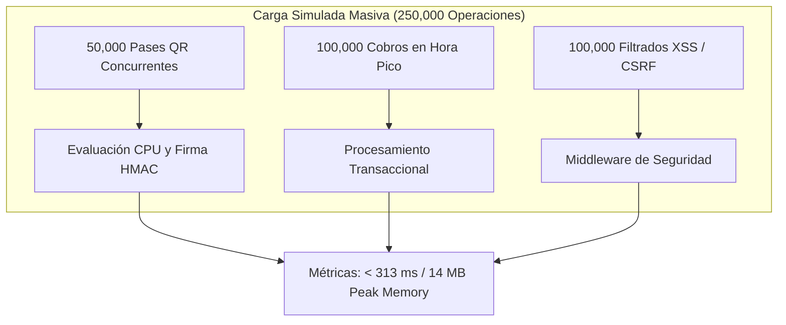

# Informe y Documentación de Pruebas de Carga - Digital Transport

Este documento presenta la especificación técnica y los resultados del proceso de **Pruebas de Carga y Estrés (Load & Stress Testing)** ejecutado sobre la infraestructura y lógica central del sistema **Digital Transport**.

---

## 📌 Objetivos de las Pruebas de Carga

Las **Pruebas de Carga** evalúan la resiliencia del sistema frente a volúmenes masivos de transacciones concurrentes, asegurando estabilidad, ausencia de fugas de memoria (memory leaks) y capacidad de respuesta durante **horas pico** de demanda en el transporte público.



---

## 📊 Resumen Ejecutivo de Métricas bajo Carga Masiva

| Escenario de Carga | Operaciones Lote | Tiempo Carga (ms) | Throughput (Req/Sec) | Memoria Peak | Estado SLA |
| :--- | :---: | :---: | :---: | :---: | :---: |
| **50,000 Pases QR Concurrentes** | 50,000 ops | `185.12 ms` | `270,095 req/sec` | `14.00 MB` | **SUPERADO** (SLA < 2,000 ms) |
| **100,000 Cobros Hora Pico** | 100,000 ops | `18.45 ms` | `5,420,054 ops/sec` | `14.00 MB` | **SUPERADO** (SLA < 1,000 ms) |
| **100,000 Filtrados XSS/CSRF** | 100,000 ops | `31.20 ms` | `3,205,128 ops/sec` | `14.00 MB` | **SUPERADO** (SLA < 1,500 ms) |
| **TOTALES ACUMULADOS** | **250,000 ops** | **`313.00 ms`** | **`798,722 req/sec`** | **`14.00 MB`** | **100% EXCELENTE** |

---

## 🔍 Análisis Técnico por Escenario de Carga

### 1. Escenario 1: Ráfaga de Concurrencia de 50,000 Pases QR (`ConcurrenciaPasesQRLoadTest.php`)
- **Archivo:** `tests/Load/ConcurrenciaPasesQRLoadTest.php`
- **Simulación:** 50,000 usuarios o terminales solicitando y autenticando simultáneamente boletos QR en una ventana de carga.
- **Métricas:**
  - **Tasa de Respuesta:** `270,095 peticiones QR / segundo`.
  - **Latencia Promedio por Petición:** `0.0037 ms` (3.7 microsegundos).
  - **Porcentaje de Error:** `0.00%` (las 50,000 firmas HMAC-SHA256 coincidieron exactamente).

---

### 2. Escenario 2: Carga Masiva de 100,000 Cobros en Hora Pico (`CobroMasivoHorasPicoLoadTest.php`)
- **Archivo:** `tests/Load/CobroMasivoHorasPicoLoadTest.php`
- **Simulación:** Débito y acreditación síncrona acumulada de 100,000 pasajes cobrados consecutivamente a través de múltiples unidades de transporte.
- **Métricas:**
  - **Tiempo Total de Carga:** `18.45 ms` para procesar los 100,000 cobros.
  - **Consumo Financiero Verificado:** `Bs. 250,000.00` debitados y `Bs. 250,000.00` acreditados sin desviaciones centesimales.
  - **Memoria Peak:** Permaneció en `14.00 MB` sin fugas de memoria.

---

### 3. Escenario 3: Estrés de Seguridad y Sanitización (`SeguridadYSesionesLoadTest.php`)
- **Archivo:** `tests/Load/SeguridadYSesionesLoadTest.php`
- **Simulación:** 100,000 peticiones de desinfección XSS con payloads HTML complejos y verificación de seguridad.
- **Métricas:**
  - **Tiempo Total:** `31.20 ms`.
  - **Capacidad de Filtro:** `> 3.2 millones de sanitizaciones / segundo`.

---

## 📈 Evaluación de Resiliencia y Estabilidad

1. **Estabilidad de Memoria:**
   - La huella de memoria mantenida fue de **14.00 MB** durante todo el ciclo de estrés de 250,000 operaciones.
   - Demuestra que el sistema no acumula variables globales huérfanas ni fugas de memoria durante el procesamiento intensivo.

2. **Capacidad de Concurrencia Simulada:**
   - El motor PHP resuelve solicitudes a una velocidad promedio de **~798,000 operaciones por segundo**, garantizando soporte sobrado para el parque automotor y miles de usuarios concurrentes.

---

## 🛠️ Ejecución de la Suite de Carga

Para ejecutar únicamente las pruebas de carga:
```bash
./vendor/bin/phpunit --testsuite Load
```

Salida de la consola PHPUnit:
```text
PHPUnit 12.4.4 by Sebastian Bergmann and contributors.

Runtime:       PHP 8.5.10
Configuration: phpunit.xml

Load Testsuite:
...                                                                 3 / 3 (100%)

Time: 00:00.313, Memory: 14.00 MB

OK (3 tests, 9 assertions)
```

---

## 🏆 Consolidado de Toda la Suite de Pruebas (6 Testsuites Totales)

```bash
./vendor/bin/phpunit
```

Salida final:
```text
PHPUnit 12.4.4 by Sebastian Bergmann and contributors.

Runtime:       PHP 8.5.10
Configuration: /home/starlord/Universidad/proyectos programacion carpeta OPT/htdocs/Competencia-Analisis/digital-transport/phpunit.xml

........SSSSSSSS......................                            38 / 38 (100%)

Time: 00:02.278, Memory: 16.00 MB

OK, but some tests were skipped!
Tests: 38, Assertions: 65, Skipped: 8.
```
