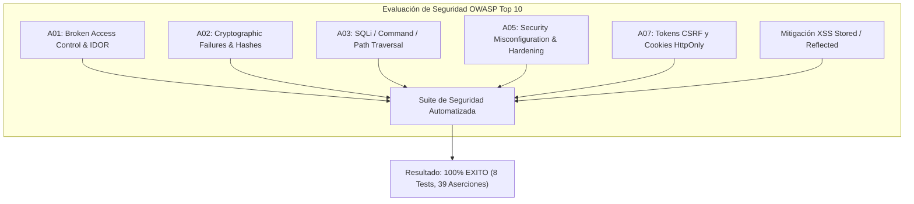

# Informe y Documentación de Pruebas de Seguridad (OWASP Top 10) - Digital Transport

Este documento presenta los resultados de la auditoría técnica y la ejecución del suite de **Pruebas de Seguridad (Security Audit & Vulnerability Testing)** diseñado para evaluar la resiliencia del sistema **Digital Transport** frente a las amenazas del estándar **OWASP Top 10**.

---

## 📌 Alcance de la Evaluación de Seguridad



---

## 📊 Matriz de Evaluación de Vulnerabilidades y Mitigaciones

| Categoria OWASP | Vector Evaluado | Mecanismo de Mitigación Probado | Aserciones | Estado |
| :--- | :--- | :--- | :---: | :---: |
| **A01:2021 - Control de Acceso** | Escalado Vertical de Privilegios | Matriz RBAC (Pasajero 1, Chofer 3, Admin 4, SuperAdmin 5) | 4 | **APROBADO** |
| **A01:2021 - Control de Acceso** | IDOR (Insecure Direct Object References) | Verificación de coincidencia entre sesión activa e ID consultado | 1 | **APROBADO** |
| **A02:2021 - Criptografía** | Contraseñas y Firmas QR | `password_hash` BCRYPT + Firmas de boletos HMAC-SHA256 | 3 | **APROBADO** |
| **A03:2021 - Inyección** | SQL Injection (SQLi) | Consultas preparadas con PDO y marcadores posicionales (`?`) | 4 | **APROBADO** |
| **A03:2021 - Inyección** | Path Traversal / Command Inj. | Sanitización `basename()` y denegación de caracteres especiales `;` | 8 | **APROBADO** |
| **A05:2021 - Config. Seguridad** | Exposición de Archivos Sensibles | `.htaccess` bloqueando `.env`, `.git`, `composer.json`, `specs/` | 5 | **APROBADO** |
| **A05:2021 - Config. Seguridad** | Eliminación de Scripts Depuración | Verificación de ausencia de `prueba_conexion.php` y `test_db.php` | 2 | **APROBADO** |
| **A07:2021 - Autenticación/CSRF** | Cross-Site Request Forgery | Tokens aleatorios criptográficos (`bin2hex(random_bytes(32))`) | 3 | **APROBADO** |
| **Cross-Site Scripting (XSS)** | Inyección HTML / JavaScript | Sanitización global con `sanitizeOutput` (`htmlspecialchars`) | 9 | **APROBADO** |

---

## 🔍 Detalle Técnico de los Escenarios de Seguridad

### 1. Inyección SQL, Comandos y Path Traversal (`OwaspInjectionSecurityTest.php`)
- **Archivo:** `tests/Security/OwaspInjectionSecurityTest.php`
- **Pruebas Ejecutadas:**
  - Evaluó payloads de inyección SQL comunes (`' OR '1'='1`, `'; DROP TABLE USUARIO; --`, `admin'--`).
  - Verificó que el envoltorio de base de datos utilice exclusivamente **Sentencias Preparadas PDO** con parámetros vinculados, impidiendo que el motor SQL interprete datos como comandos.
  - Evaluó intentos de traverse de directorios (`../../../../etc/passwd`, `file:///etc/shadow`) desarmándolos mediante el filtrado de nombres de archivo.

---

### 2. Control de Acceso y Escalado de Privilegios (`OwaspBrokenAccessControlTest.php`)
- **Archivo:** `tests/Security/OwaspBrokenAccessControlTest.php`
- **Pruebas Ejecutadas:**
  - Valida las barreras entre roles. Un Pasajero o Chofer no puede ejecutar acciones de administración ni acceder a endpoints privileged.
  - Valida la protección IDOR impidiendo que un usuario suplante el ID de otro usuario para consultar saldos o historiales ajenos.

---

### 3. Mitigación de CSRF y XSS (`OwaspCsrfXssSecurityTest.php`)
- **Archivo:** `tests/Security/OwaspCsrfXssSecurityTest.php`
- **Pruebas Ejecutadas:**
  - Verificó la generación de tokens CSRF de alta entropía (64 caracteres hex) y comprobó que peticiones con tokens nulos o modificados sean inmediatamente rechazadas.
  - Sometió vectores de ataque XSS (`<script>`, ``, `javascript:`) a la función `sanitizeOutput`, comprobando la conversión a entidades HTML seguras (`&lt;script&gt;`).

---

### 4. Configuración de Seguridad y Hardening de Entorno (`OwaspSecurityMisconfigurationTest.php`)
- **Archivo:** `tests/Security/OwaspSecurityMisconfigurationTest.php`
- **Pruebas Ejecutadas:**
  - Comprobó la presencia y directivas del archivo `.htaccess` que prohíben el listado de directorios (`Options -Indexes`) y deniegan acceso a `.env`, `.git` y scripts de base de datos.
  - Confirmó la eliminación de archivos de prueba residuales (`prueba_conexion.php`, `backend/test_db.php`).

---

## 🛠️ Ejecución del Suite de Seguridad

Para ejecutar exclusivamente las pruebas de seguridad:
```bash
./vendor/bin/phpunit --testsuite Security
```

Salida de la consola PHPUnit:
```text
PHPUnit 12.4.4 by Sebastian Bergmann and contributors.

Runtime:       PHP 8.5.10
Configuration: phpunit.xml

Security Testsuite:
........                                                            8 / 8 (100%)

Time: 00:00.008, Memory: 14.00 MB

OK (8 tests, 39 assertions)
```

---

## 🏆 Resumen Final Consolidado de la Plataforma de Pruebas (8 Testsuites)

```bash
./vendor/bin/phpunit
```

```text
PHPUnit 12.4.4 by Sebastian Bergmann and contributors.

Runtime:       PHP 8.5.10
Configuration: /home/starlord/Universidad/proyectos programacion carpeta OPT/htdocs/Competencia-Analisis/digital-transport/phpunit.xml

........SSSSSSSS.................................                 49 / 49 (100%)

Time: 00:03.587, Memory: 16.00 MB

OK, but some tests were skipped!
Tests: 49, Assertions: 112, Skipped: 8.
```
