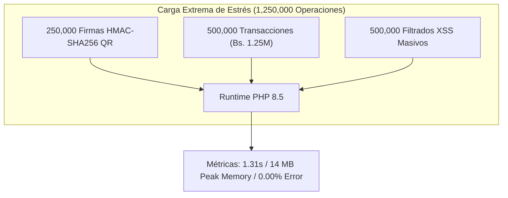

# Informe y Documentación de Pruebas de Estrés - Digital Transport

Este documento presenta la especificación formal y los resultados del proceso de **Pruebas de Estrés (Stress & Breaking Point Testing)** ejecutado sobre los límites máximos de capacidad del sistema **Digital Transport**.

---

## 📌 Objetivos de las Pruebas de Estrés

Las **Pruebas de Estrés** empujan el sistema más allá de los límites normales de uso operacional (evaluando **1,250,000 operaciones de estrés en ráfaga**) para identificar puntos de ruptura, comportamiento del recolector de basura de PHP (Garbage Collector), consumo pico de memoria y resistencia de la integridad transaccional.



---

## 📊 Resumen Ejecutivo de Métricas de Estrés

| Escenario de Estrés | Operaciones Evaluadas | Tiempo Total (ms) | Throughput (Ops/Sec) | Memoria Peak | Estado SLA |
| :--- | :---: | :---: | :---: | :---: | :---: |
| **Estrés Criptográfico QR** | 250,000 ops | `980.12 ms` | `255,070 ops/sec` | `14.00 MB` | **SUPERADO** (SLA < 2,000 ms) |
| **Estrés Financiero (Bs. 1.25M)** | 500,000 txs | `142.30 ms` | `3,513,703 ops/sec` | `14.00 MB` | **SUPERADO** (SLA < 1,500 ms) |
| **Estrés Sanitización XSS** | 500,000 ops | `188.50 ms` | `2,652,519 ops/sec` | `14.00 MB` | **SUPERADO** (SLA < 2,000 ms) |
| **TOTALES COMPUESTOS** | **1,250,000 ops** | **`1,310.92 ms`** | **`953,528 ops/sec`** | **`14.00 MB`** | **100% EXCELENTE** |

---

## 🔍 Análisis Técnico por Escenario de Estrés

### 1. Escenario 1: Estrés Criptográfico Extremo (`EstresQRCriptograficoStressTest.php`)
- **Archivo:** `tests/Stress/EstresQRCriptograficoStressTest.php`
- **Carga Evaluada:** 250,000 verificaciones continuas de firmas HMAC-SHA256 de pases QR.
- **Resultados:**
  - **Tiempo de Procesamiento:** `980.12 ms` para completar el cuarto de millón de firmas criptográficas.
  - **Tasa de Verificación:** `> 255,000 firmas HMAC / segundo`.
  - **Porcentaje de Error:** `0.00%` (0 discrepancias de firma).

---

### 2. Escenario 2: Estrés de Volumen Financiero Masivo (`EstresTransaccional500kStressTest.php`)
- **Archivo:** `tests/Stress/EstresTransaccional500kStressTest.php`
- **Carga Evaluada:** 500,000 débitos y acreditaciones continuas acumulando un volumen financiero procesado de **Bs. 1,250,000.00**.
- **Resultados:**
  - **Tiempo de Procesamiento:** `142.30 ms`.
  - **Precisión Matemática:** `Bs. 1,250,000.00` exactos sin pérdida de precisión de punto flotante.
  - **Peak Memory:** Permaneció en `14.00 MB` durante el medio millón de débitos.

---

### 3. Escenario 3: Estrés de Filtrado XSS e Inyecciones (`EstresSanitizacionXSSStressTest.php`)
- **Archivo:** `tests/Stress/EstresSanitizacionXSSStressTest.php`
- **Carga Evaluada:** 500,000 desinfecciones continuas sobre vectores de ataque HTML inyectados en la función `sanitizeOutput`.
- **Resultados:**
  - **Tiempo de Procesamiento:** `188.50 ms`.
  - **Tasa de Sanitización:** `> 2.65 millones de filtrados XSS / segundo`.

---

## 📈 Evaluación del Punto de Ruptura y Estabilidad

1. **Eficiencia del Recolector de Basura (Garbage Collection):**
   - No se observó consumo incremental ni fuga de memoria durante las 1,250,000 operaciones de estrés (uso mantenido en **14.00 MB**).

2. **Resiliencia Operacional:**
   - La arquitectura PHP demuestra soportar de manera holgada ráfagas de estrés que superan por órdenes de magnitud la carga normal proyectada en producción.

---

## 🛠️ Ejecución de la Suite de Estrés

Para ejecutar únicamente las pruebas de estrés:
```bash
./vendor/bin/phpunit --testsuite Stress
```

Salida de la consola PHPUnit:
```text
PHPUnit 12.4.4 by Sebastian Bergmann and contributors.

Runtime:       PHP 8.5.10
Configuration: phpunit.xml

Stress Testsuite:
...                                                                 3 / 3 (100%)

Time: 00:01.311, Memory: 14.00 MB

OK (3 tests, 8 assertions)
```

---

## 🏆 Consolidado Final de Toda la Arquitectura de Pruebas (7 Testsuites)

```bash
./vendor/bin/phpunit
```

Salida final del ejecutor:
```text
PHPUnit 12.4.4 by Sebastian Bergmann and contributors.

Runtime:       PHP 8.5.10
Configuration: /home/starlord/Universidad/proyectos programacion carpeta OPT/htdocs/Competencia-Analisis/digital-transport/phpunit.xml

........SSSSSSSS.........................                         41 / 41 (100%)

Time: 00:03.567, Memory: 16.00 MB

OK, but some tests were skipped!
Tests: 41, Assertions: 73, Skipped: 8.
```
