# Informe y Documentación de Pruebas de Sistema - Digital Transport

Este documento constituye la especificación técnica y el informe de ejecución oficial de las **Pruebas de Sistema (System / End-to-End Tests)** para el ecosistema **Digital Transport**.

---

## 📌 Objetivos y Alcance de las Pruebas de Sistema

Las **Pruebas de Sistema** verifican el funcionamiento integral de la aplicación evaluando flujos completos de usuario de principio a fin, reglas de negocio transversales y requisitos no funcionales (seguridad, manejo de sesiones, sanitización XSS y tokens CSRF).

```mermaid
flowchart TD
    subgraph Pasajero["Flujo de Pasajero"]
        A1[Registro / Login] --> A2[Consulta de Saldo]
        A2 --> A3[Generación de Ticket QR]
        A3 --> A4[Recarga Digital]
    end

    subgraph Chofer["Flujo de Chofer y Cobro"]
        B1[Escaneo de Ticket QR] --> B2[Verificación Criptográfica]
        B2 --> B3[Débito y Acumulación de Recaudación]
        B3 --> B4[Solicitud de Canje en Efectivo]
    end

    subgraph Seguridad["Pruebas No Funcionales y Seguridad"]
        C1[Protección CSRF] --> C2[Sanitización XSS]
        C2 --> C3[Configuración de Sesiones e I/O Env]
    end
```



---

## 📊 Resumen General de Ejecución del Sistema

| Clase de Prueba de Sistema | Módulo Probado | Casos | Aserciones | Estado |
| :--- | :--- | :---: | :---: | :---: |
| `FlujoPasajeroSystemTest` | Registro, Pase Digital QR, Saldo Bajo y Recargas | 3 | 11 | **PASÓ (100%)** |
| `FlujoChoferYCobroSystemTest` | Escaneo QR, Cobro de Pasajes, Canje Recaudación | 3 | 7 | **PASÓ (100%)** |
| `SeguridadYSistemaSystemTest` | Tokens CSRF, Sanitización XSS, Variables `.env` | 3 | 8 | **PASÓ (100%)** |
| **TOTAL** | **Sistema Completo** | **9 Casos** | **26 Aserciones** | **100% EXITO** |

---

## 🔍 Detalle Técnico de los Escenarios de Prueba

### 1. Suite: Flujo de Pasajero (`FlujoPasajeroSystemTest.php`)
- **Archivo:** `tests/System/FlujoPasajeroSystemTest.php`
- **Casos Probados:**
  1. `testFlujoRegistroPasajero`:
     - Valida la integridad del formulario de registro (nombre completo, correo estructurado con `FILTER_VALIDATE_EMAIL`, coincidencia exacta de contraseñas y longitud mínima de 8 caracteres).
     - Verifica la generación del hash con `password_hash` y la posterior verificación con `password_verify`.
  2. `testGeneracionTokenQRPaseDigital`:
     - Prueba la estructura JSON del payload contenido en el código QR del pasajero (`u`: usuario_id, `ts`: timestamp, `sig`: HMAC-SHA256).
     - Aserta que el payload sea un JSON válido y que contenga la firma de autenticidad.
  3. `testLogicaSaldoYBajoSaldoAlert`:
     - Verifica la regla del umbral de saldo bajo (`Bs. 5.00`).
     - Activa la alerta de advertencia cuando el saldo es menor a `5.00 Bs.`, simula una recarga de `20.00 Bs.` y comprueba la desactivación automática de la alerta al actualizar el saldo a `23.50 Bs.`.

---

### 2. Suite: Flujo de Chofer y Cobro (`FlujoChoferYCobroSystemTest.php`)
- **Archivo:** `tests/System/FlujoChoferYCobroSystemTest.php`
- **Casos Probados:**
  1. `testEscaneoYValidacionTicketQR`:
     - Simula la lectura del código QR del pasajero en la terminal de cobro del chofer.
     - Valida la firma HMAC-SHA256 utilizando `hash_equals` para prevenir fraude por tickets falsificados o alterados.
  2. `testProcesoCobroEIncrementoRecaudacion`:
     - Evalúa la autorización del cobro si `saldoPasajero >= tarifa`.
     - Simula la transacción disminuyendo el saldo del pasajero (`10.00 -> 7.50 Bs.`) e incrementando de forma síncrona la caja del chofer (`50.00 -> 52.50 Bs.`).
  3. `testSolicitudCanjeRecaudacionChofer`:
     - Valida las reglas de canje de saldo acumulado por choferes (`montoSolicitado >= montoMinimo (20 Bs)` y `montoSolicitado <= recaudacionActual`).
     - Comprueba el saldo remanente después de procesar la solicitud de canje.

---

### 3. Suite: Seguridad y Sistema (`SeguridadYSistemaSystemTest.php`)
- **Archivo:** `tests/System/SeguridadYSistemaSystemTest.php`
- **Casos Probados:**
  1. `testCargaVariablesEntorno`:
     - Comprueba la existencia del archivo de entorno `.env` en la raíz de la aplicación.
     - Verifica que la constante `APP_ENV` contenga un entorno permitido (`local`, `testing`, `production`).
  2. `testGeneracionYValidacionCSRF`:
     - Prueba la generación de tokens CSRF criptográficamente seguros (`bin2hex(random_bytes(32))`, 64 caracteres).
     - Aserta que `verifyCsrfToken` acepte el token legítimo y rechace cualquier token manipulado.
  3. `testSanitizacionSalidaXSS`:
     - Comprueba la función de sanitización global `sanitizeOutput`.
     - Aserta la conversión de scripts maliciosos de tipo `<script>alert('hack');</script>` a entidades HTML seguras (`&lt;script&gt;...`).

---

## 🛠️ Ejecución de las Pruebas de Sistema

Para ejecutar únicamente la suite de pruebas de sistema:
```bash
./vendor/bin/phpunit --testsuite System
```

Salida obtenida:
```text
PHPUnit 12.4.4 by Sebastian Bergmann and contributors.

Runtime:       PHP 8.5.10
Configuration: phpunit.xml

System Testsuite:
.........                                                           9 / 9 (100%)

Time: 00:00.560, Memory: 14.00 MB

OK (9 tests, 26 assertions)
```

---

## 🏆 Resumen Global de la Suite Completa (Unit + Integration + System)

Comando global:
```bash
./vendor/bin/phpunit
```

Resultado final:
```text
PHPUnit 12.4.4 by Sebastian Bergmann and contributors.

Runtime:       PHP 8.5.10
Configuration: phpunit.xml

........SSSSSSSS.........                                         25 / 25 (100%)

Time: 00:01.397, Memory: 14.00 MB

OK, but some tests were skipped!
Tests: 25, Assertions: 37, Skipped: 8.
```
